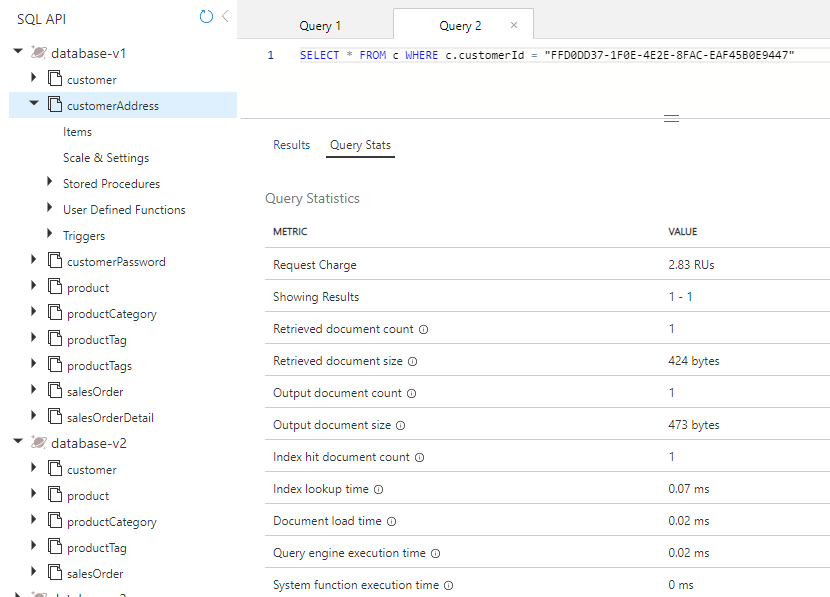
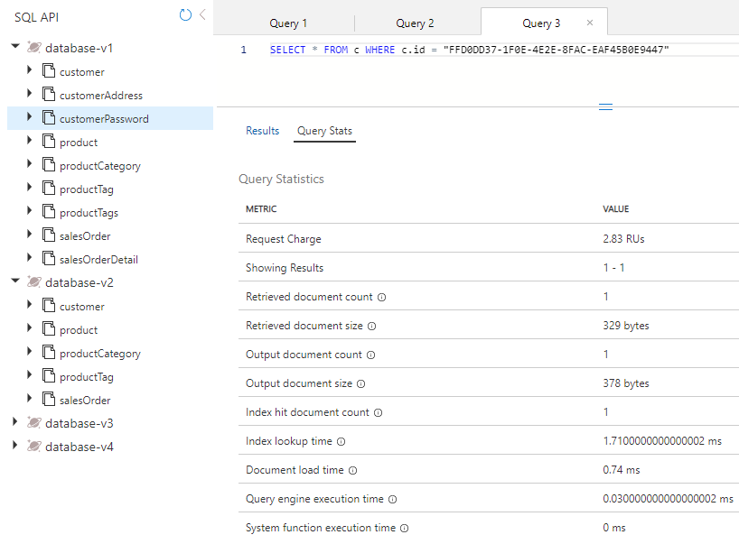

---
lab:
  title: Medición del rendimiento de entidades de cliente
  module: Module 8 - Implement a data modeling and partitioning strategy for Azure Cosmos DB for NoSQL
---

# Medición del rendimiento de entidades de cliente

En este ejercicio, medirá la diferencia en las entidades de cliente cuando modelamos las entidades como contenedores independientes en lugar de hacerlo para una base de datos NoSQL mediante la inserción de entidades en un solo documento.

## Preparación del entorno de desarrollo

Si aún no ha clonado el repositorio de código de laboratorio para **DP-420** al entorno en el que está trabajando en este laboratorio, siga estos pasos para hacerlo. De lo contrario, abra la carpeta clonada anteriormente en **Visual Studio Code**.

1. Inicie **Visual Studio Code**.

    > &#128221; Si aún no está familiarizado con la interfaz de Visual Studio Code, revise la [Guía de introducción para Visual Studio Code][code.visualstudio.com/docs/getstarted]

1. Abra la paleta de comandos y ejecute **Git: Clonar** para clonar el repositorio de GitHub ``https://github.com/microsoftlearning/dp-420-cosmos-db-dev`` en una carpeta local de su elección.

    > &#128161; Puede usar el método abreviado de teclado **CTRL+MAYÚS+P** para abrir la paleta de comandos.

1. Una vez clonado el repositorio, abra la carpeta local que seleccionó en **Visual Studio Code**.

1. En **Visual Studio Code**, en el panel **Explorador**, vaya a la carpeta **16-measure-performance**.

1. Abra el menú contextual de la carpeta **16-measure-performance** y, a continuación, seleccione **Abrir en terminal integrado** para abrir una nueva instancia de terminal.

1. Si el terminal se abre como un terminal de **Windows Powershell**, abra un nuevo terminal de **Git Bash**.

    > &#128161; Para abrir un terminal de **Git Bash**, en el lado derecho del menú del terminal, haga clic en la lista desplegable junto al signo ****+ y elija *Git Bash*.

1. En el **terminal Git Bash**, ejecute estos comandos. Los comandos abren una ventana del explorador para conectarse a Azure Portal, donde usará las credenciales de laboratorio proporcionadas.

    ```
    "C:\Program Files (x86)\Microsoft SDKs\Azure\CLI2\python.exe" -m pip install pip-system-certs
    az login
    dotnet add package Microsoft.Azure.Cosmos --version 3.22.1

    ```
    > &#128161; Si ejecutó primero el laboratorio **Costo de los datos de desnormalización** y no quitó los recursos de Azure creados por ese laboratorio, cierre el terminal integrado, omita el paso siguiente y vaya a la sección siguiente. Tenga en cuenta que si ya tiene los recursos creados por el laboratorio **Costo de los datos de desnormalización** e intenta ejecutar el script siguiente, se producirá un error en el script.

1. En el **terminal Git Bash**, ejecute estos comandos. Los comandos ejecutan un script que crea una cuenta de Azure Cosmos DB y luego compilan e inician la aplicación que usa para rellenar la base de datos y completar los ejercicios. *Una vez que haya escrito la credencial proporcionada para la cuenta de Azure, la compilación puede tardar entre 15 y 20 minutos en completarse, por lo que puede ser un buen momento para tomar un café o té*.

    ```
    bash init.sh
    dotnet build
    dotnet run --load-data
    echo "Data load process completed."

    ```
1. Cierre el terminal integrado.

## Medición del rendimiento de las entidades en contenedores independientes

En Database-v1, los datos se almacenan en contenedores individuales. En esa base de datos, ejecute consultas para obtener el cliente, la dirección del cliente y la contraseña del cliente. Revise el cargo de la solicitud para cada una de esas consultas.

### Consulta de la entidad de cliente

En Database-v1, ejecute una consulta para obtener la entidad de cliente y revise el cargo de la solicitud.

1. Vaya a Azure Portal (``portal.azure.com``) desde una nueva ventana o pestaña del explorador web.

1. Inicie sesión en el portal con las credenciales de Microsoft asociadas a su suscripción.

1. En el menú de Azure Portal o la página **Inicio**, seleccione **Azure Cosmos DB**.
1. Seleccione la cuenta de Azure Cosmos DB con el nombre que empieza por **cosmicworks**.
1. Seleccione **Explorador de datos** en la parte izquierda.
1. Expanda **Database-v1**.
1. Seleccione el contenedor **Customer**.
1. En la parte superior de la pantalla, seleccione **Nueva consulta SQL**.
1. Copie y pegue el siguiente texto SQL y seleccione **Ejecutar consulta**.

    ```
    SELECT * FROM c WHERE c.id = "FFD0DD37-1F0E-4E2E-8FAC-EAF45B0E9447"
    ```

1. Seleccione la pestaña **Estadísticas de consulta** y anote el cargo de solicitud de 2,83.

    

### Consulta de la dirección de cliente

Ejecute una consulta para obtener la entidad de dirección de cliente y revise el cargo de la solicitud.

1. Seleccione el contenedor **CustomerAddress**.
1. En la parte superior de la pantalla, seleccione **Nueva consulta SQL**.
1. Copie y pegue el siguiente texto SQL y seleccione **Ejecutar consulta**.

    ```
    SELECT * FROM c WHERE c.customerId = "FFD0DD37-1F0E-4E2E-8FAC-EAF45B0E9447"
    ```

1. Seleccione la pestaña **Estadísticas de consulta** y anote el cargo de solicitud de 2,83.

    

### Consulta de la contraseña de cliente

Ejecute una consulta para obtener la entidad de contraseña de cliente y revise el cargo de la solicitud.

1. Seleccione el contenedor **CustomerPassword**.
1. En la parte superior de la pantalla, seleccione **Nueva consulta SQL**.
1. Copie y pegue el siguiente texto SQL y seleccione **Ejecutar consulta**.

    ```
    SELECT * FROM c WHERE c.id = "FFD0DD37-1F0E-4E2E-8FAC-EAF45B0E9447"
    ```

1. Seleccione la pestaña **Estadísticas de consulta** y anote el cargo de solicitud de 2,83.

    

### Adición de los cargos de la solicitud

Ahora que hemos ejecutado todas nuestras consultas, vamos a sumar todo el costo de la unidad de solicitud de estas.

|**Consultar**|**Costo por RU/s**|
|---------|---------|
|Customer|2,83|
|Dirección del cliente|2,83|
|Contraseña de cliente|2,83|
|**Total RU/s**|**8.49**|

## Medición del rendimiento de las entidades insertadas

Ahora vamos a consultar la misma información, pero con nuestras entidades insertadas en un solo documento.

1. Seleccione la base de datos **Database-v2**.
1. Seleccione el contenedor **Customer**.
1. Ejecute la siguiente consulta. 

    ```
    SELECT * FROM c WHERE c.id = "FFD0DD37-1F0E-4E2E-8FAC-EAF45B0E9447"
    ```

1. Observe que los datos que se recuperan ahora son una jerarquía de datos de cliente, dirección y contraseña.

    

1. Seleccione **Estadísticas de consulta**. Observe el cargo de la solicitud de 2,83, frente a las 8,49 RU/s de las tres consultas que ejecutó anteriormente.

## Comparación del rendimiento de los dos modelos

Al comparar las RU/s de cada una de las consultas que ejecutó, verá que la última consulta en la que las entidades de cliente están en un solo documento es mucho menos costosa que el costo combinado por ejecutar las tres consultas de forma independiente. La latencia para devolver estos datos es menor porque los datos se devuelven en una sola operación.

Cuando se busca un único elemento y se conoce la clave de partición y el identificador de los datos, se pueden recuperar estos datos mediante una *lectura puntual* llamando a `ReadItemAsync()` en el SDK de Azure Cosmos DB. Una lectura puntual es incluso más rápida que la consulta. Para los mismos datos de cliente, el costo es de solo 1 RU/s, lo que viene a ser casi una triple mejora.

## Limpiar

Elimine el grupo de recursos creado en este laboratorio.  Si no tiene acceso para quitar el grupo de recursos, quite todos los objetos de Azure creados por este laboratorio.

[code.visualstudio.com/docs/getstarted]: https://code.visualstudio.com/docs/getstarted/tips-and-tricks
