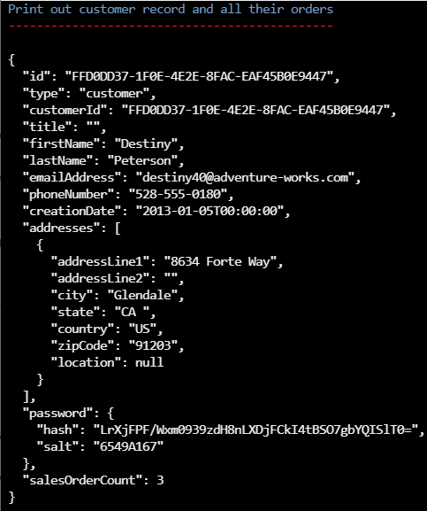

---
lab:
  title: Costo de desnormalizar datos y agregados y de usar la fuente de cambios para la integridad referencial
  module: Module 8 - Implement a data modeling and partitioning strategy for Azure Cosmos DB for NoSQL
---

# Costo de desnormalizar datos y agregados y de usar la fuente de cambios para la integridad referencial

El uso del modelo relacional podría permitirnos colocar diferentes entidades en sus propios contenedores.  Sin embargo, en las bases de datos NoSQL no hay *combinaciones* entre contenedores, por lo que es necesario empezar a desnormalizar nuestros datos para eliminar el uso de *combinaciones*. Además, NoSQL reduce el número de solicitudes mediante el modelado de los datos para que las aplicaciones puedan capturar sus datos en el menor número de solicitudes posible. Un problema que se produce al desnormalizar nuestros datos podría ser la integridad referencial entre nuestras entidades, por lo que podemos usar la fuente de cambios para mantener los datos sincronizados. La desnormalización de los agregados, como los recuentos de grupos, también puede ayudarnos a reducir las solicitudes.  

En este laboratorio, verá las ventajas de cómo desnormalizar datos y agregados puede ayudarnos a reducir el costo y cómo podemos usar la fuente de cambios para mantener la integridad referencial en los datos desnormalizados.

## Preparación del entorno de desarrollo

Si aún no ha clonado el repositorio de código de laboratorio para **DP-420** al entorno en el que está trabajando en este laboratorio, siga estos pasos para hacerlo. De lo contrario, abra la carpeta clonada anteriormente en **Visual Studio Code**.

1. Inicia **Visual Studio Code**.

    > &#128221; Si aún no estás familiarizado con la interfaz de Visual Studio Code, consulta la [Guía de introducción para Visual Studio Code][code.visualstudio.com/docs/getstarted]

1. Abre la paleta de comandos y ejecuta **Git: Clonar** para clonar el repositorio de GitHub ``https://github.com/microsoftlearning/dp-420-cosmos-db-dev`` en una carpeta local de tu elección.

    > &#128161; Puedes usar el método abreviado de teclado **CTRL+MAYÚS+P** para abrir la paleta de comandos.

1. Una vez clonado el repositorio, abra la carpeta local que seleccionó en **Visual Studio Code**.

1. En **Visual Studio Code**, en el panel **Explorador**, vaya a la carpeta **17-denormalize**.

1. Abra el menú contextual de la carpeta **17-denormalize** y, a continuación, seleccione **Abrir en terminal integrado** para abrir una nueva instancia de terminal.

1. Si el terminal se abre como un terminal de **Windows Powershell**, abra un nuevo terminal de **Git Bash**.

    > &#128161; Para abrir un terminal de **Git Bash**, en el lado derecho del menú del terminal, haga clic en la lista desplegable junto al signo ****+ y elija *Git Bash*.

1. En el **terminal Git Bash**, ejecute estos comandos. Los comandos abren una ventana del explorador para conectarse a Azure Portal, donde usará las credenciales de laboratorio proporcionadas.

    ```
    "C:\Program Files (x86)\Microsoft SDKs\Azure\CLI2\python.exe" -m pip install pip-system-certs
    az login
    dotnet add package Microsoft.Azure.Cosmos --version 3.22.1
    ```

    > &#128161; Si ejecutó primero el laboratorio **Medir el rendimiento de las entidades del cliente** y no quitó los recursos de Azure creados por dicho laboratorio, cierre el terminal integrado, omita el paso siguiente y vaya a la próxima sección. Tenga en cuenta que si ya tiene los recursos creados por el laboratorio **Medir el rendimiento de las entidades del cliente** e intenta ejecutar el script siguiente, no lo conseguirá.

    > &#128221; Si usas el nivel Gratis de Cosmos DB para este laboratorio, deberás actualizar el archivo ***azuredeploy.json*** y cambiar el rendimiento de 4000 a 1000 para todas las bases de datos y contenedores.

1. En el **terminal Git Bash**, ejecute estos comandos. Los comandos ejecutan un script que crea una cuenta de Azure Cosmos DB y luego compilan e inician la aplicación que usa para rellenar la base de datos y completar los ejercicios. *Una vez que haya escrito la credencial proporcionada para la cuenta de Azure, la compilación puede tardar entre 15 y 20 minutos en completarse, por lo que puede ser un buen momento para tomar un café o té*.

    ```
    bash init.sh
    dotnet build
    dotnet run --load-data
    echo "Data Load completed."

    ```

1. Cierre el terminal integrado.

## Ejercicio 1: Medición del rendimiento y el coste al desnormalizar datos

### Consulta del nombre de la categoría de producto

En el contenedor **database-v2**, donde los datos se almacenan en contenedores individuales, ejecute una consulta para obtener el nombre de la categoría de producto y ver el cargo de solicitud de esa consulta.

1. Vaya a Azure Portal (``portal.azure.com``) desde una nueva ventana o pestaña del explorador web.

1. Inicie sesión en el portal con las credenciales de Microsoft asociadas a su suscripción.

1. En el panel izquierdo, seleccione **Azure Cosmos DB**.
1. Seleccione la cuenta de Azure Cosmos DB con el nombre que empieza por **cosmicworks**.
1. En el panel izquierdo, seleccione **Explorador de datos**.
1. Expanda **database-v2**.
1. Seleccione el contenedor **productCategory**.
1. En la parte superior de la página, seleccione **Nueva consulta SQL**.
1. En el panel **Consulta 1**, pegue el código SQL siguiente y, a continuación, seleccione **Ejecutar consulta**.

    ```
    SELECT * FROM c where c.type = 'category' and c.id = "AB952F9F-5ABA-4251-BC2D-AFF8DF412A4A"
    ```

1. Seleccione la pestaña **Resultados** para revisar los resultados. Verá que esta consulta devuelve el nombre de la categoría de producto, "Components, Headsets".

    

1. Seleccione la pestaña **Estadísticas de consulta** y anote el cargo de solicitud de 2,92 RU (unidades de solicitud).

    

### Consulta de los productos de la categoría

Seguidamente, consulte el contenedor de productos para obtener todos los productos de la categoría "Components, Headsets".

1. Seleccione el contenedor **product**.
1. En la parte superior de la página, seleccione **Nueva consulta SQL**.
1. En el panel **Consulta 2**, pegue el código SQL siguiente y, a continuación, seleccione **Ejecutar consulta**.

    ```
    SELECT * FROM c where c.categoryId = "AB952F9F-5ABA-4251-BC2D-AFF8DF412A4A"
    ```

1. Seleccione la pestaña **Resultados** para revisar los resultados. Verá que se devuelven tres productos: "HL Headset", "LL Headset" y "ML Headset". Cada producto tiene una SKU, un nombre, un precio y una matriz de etiquetas de producto.

1. Seleccione la pestaña **Estadísticas de consulta** y anote el cargo de solicitud de 2,89 RU.

    

   > **Nota**: puedes observar un cargo de solicitud ligeramente diferente al que se notifica en este ejercicio, dentro de un intervalo de +/- 0,1.

### Consulta de las etiquetas de cada producto

A continuación, consulte el contenedor productTag tres veces para cada uno de los tres productos: "HL Headset", "LL Headset" y "ML Headset".

#### Etiquetas de HL Headset

En primer lugar, ejecute una consulta para devolver las etiquetas de HL Headset.

1. Seleccione el contenedor **productTag**.
1. En la parte superior de la página, seleccione **Nueva consulta SQL**.
1. En el panel **Consulta 3**, pegue el código SQL siguiente y, a continuación, seleccione **Ejecutar consulta**.

    ```
    SELECT * FROM c where c.type = 'tag' and c.id IN ('87BC6842-2CCA-4CD3-994C-33AB101455F4', 'F07885AF-BD6C-4B71-88B1-F04295992176')
    ```

    Esta consulta devuelve las dos etiquetas del producto HL Headset.

1. Seleccione la pestaña **Estadísticas de consulta** y anote el cargo de solicitud de 3,06 RU.

    

#### Etiquetas de LL Headset

A continuación, ejecute una consulta para devolver las etiquetas de LL Headset.

1. Seleccione el contenedor **productTag**.
1. En la parte superior de la página, seleccione **Nueva consulta SQL**.
1. En el panel **Consulta 4**, pegue el código SQL siguiente y, a continuación, seleccione **Ejecutar consulta**.

    ```
    SELECT * FROM c where c.type = 'tag' and c.id IN ('18AC309F-F81C-4234-A752-5DDD2BEAEE83', '1B387A00-57D3-4444-8331-18A90725E98B', 'C6AB3E24-BA48-40F0-A260-CB04EB03D5B0', 'DAC25651-3DD3-4483-8FD1-581DC41EF34B', 'E6D5275B-8C42-47AE-BDEC-FC708DB3E0AC')
    ```

    Esta consulta devuelve las cinco etiquetas del producto LL Headset.

1. Seleccione la pestaña **Estadísticas de consulta** y anote el cargo de solicitud de 3,47 RU.

    

#### Etiquetas de ML Headset

Por último, ejecute una consulta para devolver las etiquetas de ML Headset.

1. Seleccione el contenedor **productTag**.
1. En la parte superior de la página, seleccione **Nueva consulta SQL**.
1. En el panel **Consulta 5**, pegue el código SQL siguiente y, a continuación, seleccione **Ejecutar consulta**.

    ```
    SELECT * FROM c where c.type = 'tag' and c.id IN ('A34D34F7-3286-4FA4-B4B0-5E61CCEEE197', 'BA4D7ABD-2E82-4DC2-ACF2-5D3B0DEAE1C1', 'D69B1B6C-4963-4E85-8FA5-6A3E1CD1C83B')
    ```

    Esta consulta devuelve las cinco etiquetas del producto ML Headset.

1. Seleccione la pestaña **Estadísticas de consulta** y anote el cargo de solicitud de 3,2 RU.

    

### Suma de los cargos de RU

Ahora, vamos a sumar todos los costos de RU de cada una de las consultas que ha ejecutado.

|**Consultar**|**Costo por RU/s**|
|---------|---------|
|Nombre de la categoría|2.92|
|Producto|2.89|
|Etiquetas de producto HL|3,06|
|Etiquetas de producto LL|3.47|
|Etiquetas de producto ML|3,20|
|**Costo total de RU**|**15,54**|

### Ejecución de las mismas consultas para el diseño NoSQL

Ahora, consultará la misma información, pero en la base de datos desnormalizada.

1. En el Explorador de datos, seleccione **database-v3**.
1. Seleccione el contenedor **product**.
1. En la parte superior de la página, seleccione **Nueva consulta SQL**.
1. En el panel **Consulta 6**, pegue el código SQL siguiente y, a continuación, seleccione **Ejecutar consulta**.

    ```
   SELECT * FROM c where c.categoryId = "AB952F9F-5ABA-4251-BC2D-AFF8DF412A4A"
   ```

    Los resultados deben ser similares a los siguientes:

    

1. Revise los datos devueltos en esta consulta. Contiene toda la información necesaria para representar los productos de esta categoría, incluidos el nombre de categoría y los nombres de etiqueta de cada uno de los tres productos.

1. Seleccione la pestaña **Estadísticas de consulta** y anote el cargo de solicitud de 2,89 RU.

### Comparación del rendimiento de los dos modelos

En el modelo relacional, donde los datos se almacenan en contenedores individuales, ejecutó cinco consultas para obtener el nombre de la categoría, todos los productos de esa categoría y todas las etiquetas de producto para cada uno de los productos. El cargo de solicitud de las cinco consultas totalizó 15,56 RU.

Para obtener la misma información en el modelo NoSQL, ejecutó una consulta en la que el cargo de solicitud era de 2,9 RU.

La ventaja no es solo el menor costo de un diseño NoSQL como este modelo. Este tipo de diseño también es más rápido porque solo requiere una única solicitud. Además, los propios datos se sirven en la forma en la que probablemente se representan en una página web. Esto significa menos código para escribir y mantener el flujo de bajada en la aplicación de comercio electrónico.

Al desnormalizar los datos, se generan consultas más sencillas y eficaces para la aplicación de comercio electrónico. Puede almacenar todos los datos que necesita la aplicación en un solo contenedor y capturarlos con una sola consulta. Cuando se trabaja con consultas de simultaneidad elevadas, este tipo de modelado de datos puede proporcionar enormes ventajas en simplicidad, velocidad y costo.

---

## Ejercicio 2: Uso de la fuente de cambios para administrar la integridad referencial

En esta unidad, verá cómo la fuente de cambios puede mantener la integridad referencial entre dos contenedores en Azure Cosmos DB. En este escenario usará la fuente de cambios para escuchar el contenedor productCategory. Al actualizar el nombre de una categoría de producto, la fuente de cambios captura el nombre actualizado y actualiza todos los productos de esa categoría con el nuevo nombre.

En este ejercicio, realizará los pasos siguientes:

- Complete código de C# para resaltar los conceptos clave que debe comprender.
- Inicie el procesador de fuente de cambios para que empiece a escuchar el contenedor de productCategory.
- Consulte el contenedor de productos para la categoría a la que va a cambiar el nombre y el número de productos de esa categoría.
- Actualice el nombre de categoría y la fuente de cambios de inspección propagará los cambios al contenedor de productos.
- Consulte el nuevo contenedor de productos con el nuevo nombre de categoría y cuente el número de productos para asegurarse de que todos se han actualizado.
- Vuelva a cambiar el nombre al original y la fuente de cambios de inspección propagará los cambios de nuevo.

### Inicio de Azure Cloud Shell y apertura de Visual Studio Code

Para ir al código que actualizará para la fuente de cambios, siga estos pasos:

1. Si aún no está abierto, abra Visual Studio Code y abra el archivo *Program.cs* en la carpeta *17-desnormalize*.

### Completar el código de la fuente de cambios

Agregue código para controlar los cambios pasados en el delegado y recorrer en bucle cada uno de los productos de esa categoría y actualizarlos.

1. Vaya a la función que inicia el procesador de fuente de cambios.

1. Seleccione CTRL + G y después escriba **603** para ir a esa línea en el archivo.

1. Ahora debería ver el siguiente código:

    

   En las líneas 588 y 589 hay dos referencias de contenedor. Es necesario actualizarlas con los nombres de contenedor correctos. La fuente de cambios funciona creando una instancia del procesador de fuente de cambios en la referencia del contenedor. En este caso, estamos buscando cambios en el contenedor productCategory.

1. En la línea 588, reemplace **{container to watch}** por `productCategory`.

1. En la línea 589, reemplace **{container to update}** por `product`. Cuando se actualiza un nombre de categoría de producto, todos los productos de esa categoría deben actualizarse con el nuevo nombre de categoría de producto.

1. Debajo de las líneas *container to watch* y *container to update*, revise la línea *leaseContainer*. leaseContainer funciona como un punto de comprobación en el contenedor. Sabe lo que se ha actualizado desde la última vez que el procesador de la fuente de cambios lo comprobó.
  
   Cuando la fuente de cambios ve un nuevo cambio, llama a un delegado y pasa los cambios a una colección de solo lectura.

1. En la línea 603 es necesario agregar código al que se llamará cuando la fuente de cambios tenga un nuevo cambio que deba procesarse. Para ello, copie el siguiente fragmento de código y péguelo debajo de la línea que comienza por **//To-Do:**.

    ```
    //Fetch each change to productCategory container
    foreach (ProductCategory item in input)
    {
        string categoryId = item.id;
        string categoryName = item.name;
    
        tasks.Add(UpdateProductCategoryName(productContainer, categoryId, categoryName));
    }
    ```

1. El código debería tener un aspecto parecido al de la siguiente imagen:

    

    La fuente de cambios se ejecuta cada segundo de forma predeterminada. En escenarios en los que se realizan muchas inserciones o actualizaciones en el contenedor visto, el delegado puede tener más de un cambio. Por este motivo, escriba la **entrada** del delegado como **IReadOnlyCollection**.

    Este fragmento de código recorre en bucle todos los cambios de la **entrada** del delegado y los guarda como cadenas para **categoryId** y **categoryName**. Seguidamente, agrega una tarea a la lista de tareas con una llamada a otra función que actualiza el contenedor de productos con el nuevo nombre de categoría.

1. Seleccione Ctrl+G y escriba **647** para buscar la función **UpdateProductCategoryName()**. Aquí se escribe código que actualiza cada producto del contenedor de productos con el nuevo nombre de categoría que ha capturado la fuente de cambios.

1. Copie el siguiente fragmento de código y péguelo debajo de la línea que comienza por **//To-Do:**. La función realiza dos acciones. Primero consulta el contenedor de productos para todos los productos que han pasado a **categoryId**. Luego actualiza cada producto con el nuevo nombre de categoría de producto.

    ```
    //Loop through all products
    foreach (Product product in response)
    {
        productCount++;
        //update category name for product
        product.categoryName = categoryName;
    
        //write the update back to product container
        await productContainer.ReplaceItemAsync(
            partitionKey: new PartitionKey(categoryId),
            id: product.id,
            item: product);
    }
    ```

    Ahora el código debería tener un aspecto parecido al siguiente.

    

    El código lee las filas del objeto de respuesta de la consulta y luego actualiza el contenedor de productos con todos los productos que ha devuelto la consulta.

    Está usando un bucle **foreach()** para recorrer cada producto que ha devuelto la consulta. Para cada fila, actualice un contador para saber cuántos productos se actualizaron. Después actualice el nombre de categoría del producto al nuevo **categoryName**. Por último, llame a **ReplaceItemAsync()** para actualizar el producto de nuevo en el contenedor de productos.

1. Seleccione CTRL+S para guardar los cambios.

1. Si aún no está abierto, abra un terminal integrado de Git Bash y asegúrese de que está en la carpeta *17-desnormalize*.

1. Para compilar y ejecutar el proyecto ejecute el siguiente comando:

    ```
    dotnet build
    dotnet run
    ```

1. La pantalla debería mostrar ahora el menú principal de la aplicación.

    

### Ejecución del ejemplo de fuente de cambios

Ahora que ha completado el código de la fuente de cambios, vamos a verlo en acción.

1. En el menú principal, seleccione **a** para iniciar el procesador de fuente de cambios. La pantalla muestra el progreso.

    

1. Presione cualquier tecla para volver al menú principal.

1. Seleccione **b** en el menú principal para actualizar el nombre de la categoría de producto. Tiene lugar la siguiente secuencia:

    a. Consulta el contenedor de productos para la categoría "Accesorios, neumáticos y cámaras", y cuenta cuántos productos hay en esa categoría.  
    b. Actualiza ese nombre de categoría y reemplaza la palabra "y" por una y comercial "&".  
    c. La fuente de cambios recoge ese cambio y, con el código que ha escrito, actualiza todos los productos de esa categoría.  
    d. La fuente de cambios revierte el cambio de nombre y vuelve a cambiar el nombre de la categoría, reemplazando "&" por la "y" original.  
    e. Después, la fuente de cambios recoge ese cambio y actualiza todos los productos de nuevo al nombre de categoría de producto original.

1. Seleccione **b** en el menú principal y siga las indicaciones hasta que la fuente de cambios se ejecute una segunda vez, y luego mantenga presionado. Los resultados tendrán un aspecto similar al siguiente:

    

1. Si se ha pasado al hacer clic y ha vuelto al menú principal, vuelva a seleccionar **b** para observar los cambios.

1. Cuando haya terminado, escriba **x** para salir y volver a Cloud Shell.

---

## Ejercicio 3: Desnormalización de agregados

En esta unidad, verá cómo desnormalizar un agregado para escribir la consulta de los 10 clientes principales para el sitio de comercio electrónico. Usará la característica de lote transaccional en el SDK de .NET de Azure Cosmos DB, que inserta simultáneamente un nuevo pedido de venta y actualiza la propiedad **salesOrderCount** del cliente, estando ambas en la misma partición lógica.

En este ejercicio, realizará los pasos siguientes:

- Ver el código para crear un nuevo pedido de venta.
- Completar el código de C# para incrementar la propiedad *salesOrderCount* del cliente.
- Completar el código de C# para implementar la transacción para insertar el nuevo pedido de venta y actualizar el registro de cliente mediante el *lote transaccional*.
- Ejecutar una consulta para un cliente específico para ver el registro de cliente y todos sus pedidos.
- Crear un nuevo pedido de venta para ese cliente y actualizar su propiedad **salesOrderCount**.
- Ejecutar la consulta de los 10 clientes principales para ver cuáles son los resultados actualmente.
- Mostrar cómo se puede usar el lote transaccional cuando un cliente cancela un pedido.

## Abra Visual Studio Code.

Para obtener el código que usará en esta unidad, siga estos pasos:

1. Si aún no está abierto, abra Visual Studio Code y abra el archivo *Program.cs* en la carpeta *17-desnormalize*.

## Completar el código para actualizar el total de pedidos de venta

1. Vaya a la función que crea un nuevo pedido de venta.

1. Seleccione Ctrl+G y después escriba **483** para ir a esa línea en el archivo.

1. Ahora debería ver el siguiente código:

    

    Esta función crea un nuevo pedido de venta y actualiza el registro de cliente mediante el lote transaccional.

    En primer lugar, el registro de cliente se recupera mediante una llamada a **ReadItemAsync()** y pasando **customerId** como la clave de partición y el identificador.

1. En la línea 483, debajo del comentario **//To-Do:**, incremente el valor de **salesOrderCount** pegando el siguiente fragmento de código:

    ```
    //Increment the salesOrderTotal property
    customer.salesOrderCount++;
    ```

    Ahora la pantalla debería tener el aspecto siguiente:

    

## Completar el código para implementar el lote transaccional

1. Desplácese hacia abajo unas líneas para ver los datos del nuevo pedido de venta que creará para el cliente.

    El nuevo objeto de pedido de venta tiene una estructura de encabezado y detalles típica de los pedidos de venta en una aplicación de comercio electrónico.

    El encabezado de pedido de venta tiene **orderId**, **customerId**, **orderDatey** y **shipDate**, que dejará en blanco.

    Dado que el contenedor de clientes contiene entidades de cliente y de pedido de ventas, el objeto de pedido de ventas también contiene la propiedad Discriminator, **type**, con el valor de **salesOrder**. Esto le ayuda a distinguir un pedido de ventas de un objeto de cliente en el contenedor del cliente.

    Más abajo también puede ver los dos productos del pedido que componen la sección de detalles del pedido de venta.

1. Desplácese un poco más lejos hasta otro comentario **//To-Do:**. Aquí debe agregar un código que inserta un nuevo pedido de venta y actualiza el registro de cliente mediante el lote transaccional.

1. Copie el siguiente fragmento de código y péguelo en la línea debajo del comentario **//To-Do:**.

    ```
    TransactionalBatchResponse txBatchResponse = await container.CreateTransactionalBatch(
        new PartitionKey(salesOrder.customerId))
        .CreateItem<SalesOrder>(salesOrder)
        .ReplaceItem<CustomerV4>(customer.id, customer)
        .ExecuteAsync();
    if (txBatchResponse.IsSuccessStatusCode)
        Console.WriteLine("Order created successfully");
    ```

    Este código llama a **CreateTransactionalBatch()** en el objeto contenedor. Toma el valor de clave de partición como parámetro necesario, porque todas las transacciones tienen un alcance de una sola partición lógica. También pasará el nuevo pedido de venta, llamando a **CreateItem()**, y el objeto de cliente actualizado, llamando a **ReplaceItem()**. A continuación, llame a **ExecuteAsync()** para ejecutar la transacción.

    Por último, compruebe si la transacción se ha realizado correctamente al observar el objeto de respuesta.

    La pantalla debería tener un aspecto similar a la siguiente imagen:

    

1. Seleccione CTRL+S para guardar los cambios.

1. Si aún no está abierto, abra un terminal integrado de Git Bash y asegúrese de que está en la carpeta *17-desnormalize*.

1. Para compilar y ejecutar el proyecto ejecute el siguiente comando:

    ```
    dotnet build
    dotnet run
    ```

1. La pantalla debería mostrar ahora el menú principal de la aplicación, como se muestra a continuación:

    

## Consulta del cliente y sus pedidos de venta

Dado que ha diseñado la base de datos para almacenar tanto a los clientes como a todos sus pedidos de venta en el mismo contenedor usando **customerId** como clave de partición, puede consultar el contenedor de cliente y devolver el registro de cliente y todos sus pedidos de venta en una sola operación.

1. En el menú principal, seleccione **c** para ejecutar el elemento de menú para **Consulta del cliente y todos los pedidos**. Esta consulta devuelve el registro del cliente, seguido de todos los pedidos de ventas del cliente. Debería ver la salida de todos los pedidos de ventas del cliente en la pantalla.

   Observe que el último pedido fue para un **Road-650 Red, 58** por 782,99 USD.

1. Desplácese hacia arriba hasta **Imprimir registro de cliente y todos sus pedidos**.

   Tenga en cuenta que la propiedad **salesOrderCount** muestra dos pedidos de ventas.

   La pantalla debería mostrar lo siguiente:

    

## Creación de un nuevo pedido de venta y actualización del total de pedidos de venta en una transacción

Cree un nuevo pedido de venta para el mismo cliente y actualice el total de pedidos de venta guardados en su registro de cliente.

1. Presione cualquier tecla de la ventana para volver al menú principal.
1. Seleccione **d** para ejecutar el elemento de menú para **Crear nuevo pedido y actualizar el total del pedido**.
1. Presione cualquier tecla para volver al menú principal.
1. Seleccione **c** para volver a ejecutar la misma consulta.

   Observe que el nuevo pedido de venta muestra **HL Mountain Frame - Black, 38** y **Racing Socks, M**.

1. Vuelva a desplazarse hacia arriba hasta **Imprimir registro de cliente y todos sus pedidos**.

   Tenga en cuenta que la propiedad **salesOrderCount** muestra tres pedidos de ventas.

1. La pantalla debería mostrar lo siguiente:

    

## Eliminación de un pedido mediante lote transaccional

Al igual que cualquier aplicación de comercio electrónico, los clientes también cancelan pedidos. Aquí puede hacer lo mismo también.

1. Presione cualquier tecla para volver al menú principal.

1. Seleccione **f** para ejecutar el elemento de menú para **Eliminar pedido y actualizar el total del pedido**.

1. Presione cualquier tecla para volver al menú principal.
1. Seleccione **c** para volver a ejecutar la misma consulta para confirmar que el registro de cliente está actualizado.

   Observe que ya no se devuelve el nuevo pedido. Si se desplaza hacia arriba, puede ver que **salesOrderCount** ha vuelto a **2**.

1. Presione cualquier tecla para volver al menú principal.

## Ver el código que elimina un pedido de venta

Se elimina un pedido de ventas exactamente de la misma manera que se crea uno. Ambas operaciones se encapsulan en una transacción y se ejecutan en la misma partición lógica. Echemos un vistazo al código que hace estas operaciones.

1. Escriba **x** para salir de la aplicación.
1. Si aún no está abierto, abra Visual Studio Code y abra el archivo *Program.cs* en la carpeta *17-desnormalize*.

1. Seleccione Ctrl+G y, a continuación, escriba **529**.

    Esta función elimina el nuevo pedido de venta y actualiza el registro de cliente.

    Aquí puede ver que el código recupera primero el registro de cliente y después disminuye **salesOrderCount** en 1.

    A continuación, se llama a **CreateTransactionalBatch().**. De nuevo, se pasa el valor de clave de partición lógica, pero esta vez, se llama a **DeleteItem()** con el identificador de pedido y se llama a **ReplaceItem()** con el registro de cliente actualizado.

## Visualización del código de la consulta de los 10 clientes principales

Echemos un vistazo a la consulta para los 10 clientes principales.

1. Seleccione Ctrl+G y, a continuación, escriba **566**.

    Cerca de la parte superior está la definición de la consulta.

    ```
    SELECT TOP 10 c.firstName, c.lastName, c.salesOrderCount
        FROM c WHERE c.type = 'customer'
        ORDER BY c.salesOrderCount DESC
    ```

    Esta consulta es bastante sencilla con una instrucción **TOP** para limitar el número de registros devueltos y una instrucción **ORDER BY** en nuestra propiedad **salesOrderCount** en orden descendente.

    Observe también la propiedad Discriminator de **type** con un valor de **customer**, por lo que solo devuelve clientes, ya que nuestro contenedor de clientes incluye tanto clientes como pedidos de venta.

1. Para volver a iniciar la aplicación si aún no se está ejecutando, ejecute el comando siguiente:

    ```
    dotnet run
    ```

1. Por último, escriba **e** para ejecutar la consulta.

    

    Quizás no se dé cuenta de que la consulta de los 10 clientes principales es una consulta entre particiones que se realiza en todas las particiones del contenedor.

    El laboratorio complementario a este señaló que debe procurar evitar consultas entre particiones. Sin embargo, en realidad, dichas consultas pueden ser correctas en situaciones en las que el contenedor sigue siendo pequeño o si la consulta no se ejecuta con frecuencia. Si la consulta se ejecuta con frecuencia o el contenedor es excepcionalmente grande, merece la pena explorar el costo de materializar estos datos en otro contenedor y usarlos para atender esta consulta.

## Limpiar

Elimine el grupo de recursos creado en este laboratorio.  Si no tiene acceso para quitar el grupo de recursos, quite todos los objetos de Azure creados por este laboratorio.

[code.visualstudio.com/docs/getstarted]: https://code.visualstudio.com/docs/getstarted/tips-and-tricks
